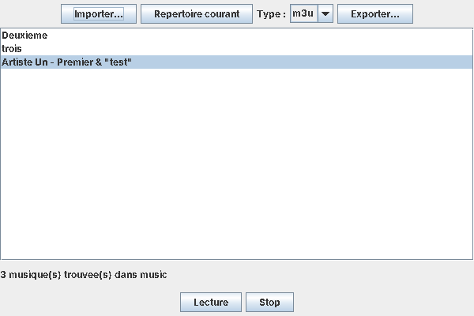

# Gestionnaire de playlists

Application Java pour gérer des playlists de musiques MP3 : importer des musiques, les sélectionner et exporter la playlist en M3U, XSPF ou JSPF. Elle s'utilise en ligne de commande ou avec une petite interface graphique Swing. La lecture se limite à lecture et stop.

Projet réalisé en [À COMPLÉTER : L1 ou L2], [À COMPLÉTER : année]. Le code source d'origine a été perdu, ce dépôt est une réécriture faite en 2026 à partir de la description du projet.

## Technos

- Java (Swing pour l'interface)
- JLayer (lecture des MP3)

## Lancer le projet

Il faut un JDK. Pour lire les MP3, il faut aussi la bibliothèque JLayer : télécharger `jlayer-1.0.1.4.jar` sur https://mvnrepository.com/artifact/com.googlecode.soundlibs/jlayer/1.0.1.4 et le mettre dans un dossier `lib/` à la racine du projet. Sans ce jar, tout marche sauf la lecture.

Compiler :

```
javac -cp lib/jlayer-1.0.1.4.jar -d out src/playlist/*.java
```

Interface graphique (sans argument) :

```
java -cp "out;lib/jlayer-1.0.1.4.jar" playlist.Main
```

Sous Linux ou macOS, remplacer `;` par `:` dans le classpath.

Ligne de commande, depuis le dossier qui contient les musiques :

```
java -cp "out;lib/jlayer-1.0.1.4.jar" playlist.Main -help
```

- `-h <fichier>` : affiche les métadonnées d'une musique (nom, taille, format, et titre, artiste, album si le fichier a un tag ID3v1)
- `-u` : sélectionne toutes les musiques MP3 du répertoire courant (la sélection est écrite dans `selection.txt`)
- `-o <type>` : crée `playlist.<type>` avec toute la sélection, en affichant les données de chaque musique ajoutée. Types : `m3u`, `xspf`, `jspf`
- `-help` : affiche l'aide

## Captures d'écran



## Ce que j'ai fait

[À COMPLÉTER : ma part du projet, et si j'ai travaillé seul ou avec d'autres]
